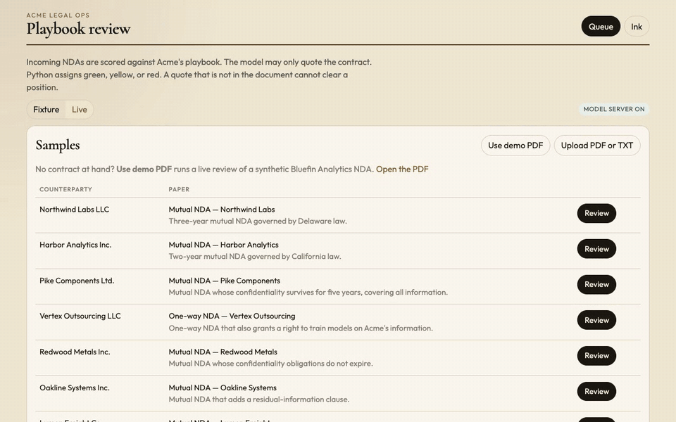

# Playbook Review

A legal-ops desk for incoming NDAs. The model quotes the contract. A company playbook, in Python, decides whether counsel has to read it.

This is a local demo. It is not legal advice.



*A live review of the bundled demo PDF on Qwen2.5-14B, sped up. The model lane (purple) extracts quotes and drafts comments. The Python lane (teal) checks the quotes, applies the rules, and picks the route. Extraction takes about a minute on an M4 Pro. Every Python step takes a few milliseconds.*

## The problem

One counsel, a queue of vendor NDAs. Standard paper should clear the same day. Anything that breaks the playbook should land on the desk with the sentence that broke it, not a chatbot paragraph.

A quote that is not actually in the contract cannot clear a position. The model is not allowed to assign green, yellow, or red.

## Route

| Route | Meaning |
| --- | --- |
| Green | Every position is an accept, and every quote is a verbatim span of the contract. |
| Yellow | A fallback, or a non-critical reject. Counsel glances. |
| Red | A critical position is a reject, is ungrounded, or is missing where absence is a reject. |
| Out of playbook | The document is not an NDA. It is not scored. |

Approving a yellow or red matter does not rewrite the route to green. That action is "approve with exceptions" and it stays in the audit log. Eval ignores counsel overrides. It scores the model route only.

## False-green

False-green is a matter the system marked green when the labeled route was not green. On the eight-contract fixture set the baseline is 0/8. That set is a demo, not a CUAD benchmark. A separate fixture paraphrases every quote of a clean NDA. Those quotes fail the citation gate, and the route is red.

Position-level false-accept counts an `accept` where the label was `fallback`, `reject`, or `ungrounded`.

## How a review runs

1. Read the text (PDF via `pdfplumber`, or TXT).
2. One model call extracts, for each playbook position, a verbatim excerpt and a few fields. Temperature 0. Invalid JSON is retried once.
3. The citation gate checks that the excerpt is a whitespace-normalized substring of the contract. If it is not, the position is `ungrounded`.
4. A Python rule for that position reads the fields. The rules are a registry, not a prompt.
5. A second model call, only for fallback and reject, phrases the playbook's fallback sentence as a redline comment. If that call fails, the playbook sentence is used as-is. The route does not change.
6. The router sums the verdicts.

Fixture mode replays a recorded extraction and does not call the model. Use it to demo the desk when the model server is off. Live mode calls the server. If the server is down, live mode returns an error. It does not silently fall back to fixtures.

## Model

The app does not load MLX. MLX needs Metal, and the API container is Linux. Run the model on the Mac, then point the API at it.

Weights already in the local Hugging Face cache, served with `mlx_lm` from `~/.venv-vllm-metal`:

```bash
source ~/.venv-vllm-metal/bin/activate
python -m mlx_lm.server \
  --model mlx-community/Qwen2.5-14B-Instruct-8bit \
  --host 127.0.0.1 \
  --port 8080
```

Qwen2.5-14B-Instruct is the default because it is an instruct model already quantized for MLX, and this machine is an M4 Pro with 24GB. The vision model and the reasoning distillations on disk are the wrong tool for verbatim JSON.

| Variable | Default |
| --- | --- |
| `LLM_BASE_URL` | `http://127.0.0.1:8080/v1` inside a host process, `http://host.docker.internal:8080/v1` in Compose |
| `LLM_MODEL` | `mlx-community/Qwen2.5-14B-Instruct-8bit` |
| `LLM_API_KEY` | `not-needed` |

On this M4 Pro, one short NDA takes about a minute to two minutes, because the review makes two calls. The screen streams each step while that happens.

## Run

API and UI, model optional:

```bash
# terminal 1
cd backend
uv sync
uv run uvicorn app:app --reload --port 8000

# terminal 2
cd frontend
npm install
npm run dev
```

Open http://localhost:5173. Fixture mode reviews all eight samples with no model server.

No contract at hand? In live mode, **Use demo PDF** reviews `data/demo/Bluefin-Analytics-NDA.pdf`, a synthetic mutual NDA with a four-year term, an archival copy, no compelled-disclosure notice, a narrow non-solicit, and Texas law. It has no fixture, so it needs the model server.

The Eval screen is hidden in the UI. Start the frontend with `VITE_SHOW_EVAL=true` to bring it back. The API is unchanged.

Or, with Docker Desktop, leave the model server on the host at port 8080 and run:

```bash
docker compose up --build
```

The Compose API is on port 8000, the UI on port 5173. The model is not inside the containers.

## Tests

```bash
cd backend
uv run pytest
```

Pytest does not call the model. It checks the citation gate, the router, every playbook rule, the eight gold routes, the paraphrase fixture, and the decision API: a red matter cannot be approved into a green one, and an override does not move the model route that eval reads.

## Layout

```
backend/          FastAPI, playbook rules, OpenAI-compatible client
frontend/         React desk: queue, review, eval
data/playbook/    Acme NDA playbook (YAML)
data/samples/     8 synthetic contracts
data/gold/        labeled routes
data/fixtures/    recorded extractions, plus one paraphrased extraction
data/demo/        a demo PDF for live mode
```

## What this demo leaves out

Auth, a database, Word redlines, and any playbook other than vendor NDAs. An order form is out of playbook on purpose. The residual risk in live mode is a real quote paired with a field the quote does not support. The gate stops invented quotes. It does not yet entail the field from the quote.
